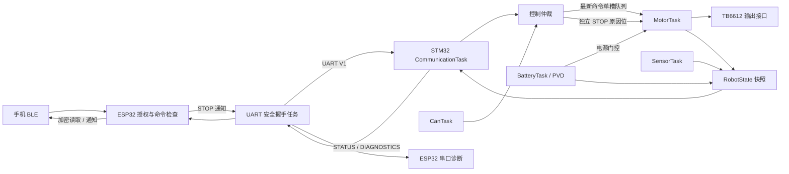

# STM32 + ESP32 双主控机器人：软件工程说明

本项目是**未完成、未通过硬件验收的原型**。本轮始于2026-09-22，最新软件补测与交付整理见第11节（2026-10-07）。2026-10-05用户明确要求烧录检测后，曾完成ESP32 6.1烧录及约45秒启动观察，实际证据与限制单列第10节。本轮不操作设备；源码/电脑检查与设备观察分别记录，历史文档中的硬件成功描述不作为验收依据。

## 1. 主工程与边界

唯一维护入口是本目录的父目录 `stm32-esp32-freertos-robot`，包含 `stm32/`、`esp32/`、`shared/`、`software_checks/` 和 `verify.ps1`。它原本已有独立 Git 仓库及双端构建入口，适合作为统一交付单元。开始检查时，比对过外层 `robot/Application` 与主工程 `stm32/Application`、外层 `esp32/main` 与主工程 `esp32/main`，对应文件内容一致；这不表示构建目录、所有外设配置和全部历史资料均逐字一致。外层副本保留，此后不随主工程更新。

本轮完成范围：默认 STOP-only 软件链路、控制与状态边界的回归测试、跨板诊断、可复现构建和设计解释。没有交付可实机运行的运动系统；没有新增 BLE DRIVE 转发、自动避障、速度 PID 或 OTA。BLE入口拒绝DRIVE，STM32仲裁入口拒绝CAN/AUTO非零运动；内部UART运动路径继续保留。这不是STM32所有输入的全局运动禁用开关。

2026-10-04仅按职责分类移动代码，目录导航以[根README](../README.md)为准。任务/模块接口及安全策略不变，CubeMX/厂商目录保持原布局，ESP32仍是同一个main组件；两端构建及20组电脑检查重新通过。文中链接已更新到新位置，历史缺陷与硬件证据边界不变。

2026-10-05 ESP32构建基线同步到[官方ESP-IDF v6.1](https://github.com/espressif/esp-idf/releases/tag/v6.1)，实际GCC15.2.0。采用现有[工程CMake](../esp32/CMakeLists.txt)限制6.1.x、最低CMake3.22；重新生成配置，并在[defaults](../esp32/sdkconfig.defaults)固定100 Hz tick，依靠关闭Central角色禁用GATT client。替代方案是保留5.4.4或并行维护两个SDK，但本次明确升级，没有实际双版本维护需求，不增加兼容分支。UART/BLE协议与安全策略不变；代价是旧SDK现在拒绝配置，SDK内部依赖警告、NimBLE运行行为和NVS绑定跨版本兼容需继续验证。20组检查、双端构建与旧SDK拒绝检查通过；额外的新旧host栈/绑核配置读取未获批准，静态对照未完成，不能声称全部配置等价。完整证据、SDK警告与复现命令集中在[验证记录](../software_checks/README.md)。

## 2. 系统职责与完整数据流



### 控制链

- BLE 回调先检查当前连接、授权、固定 10 B 长度，再做版本、CRC、操作码和范围校验。合法 DRIVE 也被拒绝并请求 STOP。见 [robot_ble.c](../esp32/main/ble/robot_ble.c) 的 `CommandAccess`。
- BLE 写入成功只表示 STOP 请求被 ESP32 接受，不代表串口发送完成或电机已停车。手机序号当前用于记录；ESP32 单独维护 UART 控制序号。
- `RobotUartLink_RequestStop` 使用任务通知，唯一发送者 UART link task 发 STOP；RX task 解析响应，通过 ACK 队列和最新 STATUS 邮箱交给 link task。
- STM32 `HandleFrame` 做语义检查；`ControlArbiter_SubmitUart/Can` 决定模式、控制权、序号、保护状态和是否入队。STOP 独立于命令队列，重复或旧序号 STOP 仍可执行。
- MOTOR ACK=OK 表示仲裁接受并提交到队列，STOP ACK=OK 表示停止请求已登记；两者都不等于机械动作完成。
- MotorTask 每 10 ms 消费停止原因或最新命令。STOP 丢弃排队命令；电源失效、超过 300 ms 无新运动命令会清除命令状态。恢复必须收到新的合法命令。HEARTBEAT 不刷新运动命令有效期。
- PVD 紧急停车走直接寄存器路径，优先级 4，不调用 RTOS；其电气阈值及实际响应均待测。

### 反馈链与语义

Sensor/Battery/Motor 更新受短临界区保护的 RobotState。CommunicationTask 发送 STATUS 前主动使过期传感数据和电池数据失效，不依赖低优先级显示/存储任务清理状态。STATUS 中电池 mV、距离 mm、PWM 千分比，`0xFFFF` 表示无效测量，另有有效位、模式、错误位和控制源。状态帧里 PWM 是软件记录的驱动输出，不是编码器测量，更不是实际车速。

ESP32 校验后保存 STATUS 的本机接收时间。上电/STOP/断连/链路故障进入握手，只有匹配本轮序号的 STOP ACK 加上**严格晚于 ACK 处理时刻**的新鲜零输出状态才 ONLINE；同 tick 数据保守地等待下一帧。在线后只检查状态新鲜和零输出，不再用初次 ACK 时间做无限期有符号比较。新鲜阈值 500 ms；等待 ACK 后的零输出超过 1200 ms 重启握手，STOP 每 250 ms 重试。见 [robot_link_safety.c](../esp32/main/uart/robot_link_safety.c)。

这仍是 STOP-only 策略。将来开放 DRIVE 时，必须同时新增授权命令转发、命令期限/ACK 处理和运动状态策略；不能仅删除 BLE 的拒绝分支。当前零输出状态只是软件停车确认，不能证明车轮停止。

### 模式与控制权

UART内部运动仅 BLE 模式；CAN协议定义非零运动仅 AUTO 模式，但当前仲裁器进一步拒绝合法前向CAN运动，返回 `CONTROL_RESULT_SAFETY_BLOCKED`，消费序号、不取得控制权、不入队。AUTO仍可切换和反馈，没有自动导航算法，也不代表运动已启用；即使ESP32未连接，CAN运动仍被拒绝。所有来源的合法STOP保持全局生效，包括重复/旧序号。

所有权租约 300 ms，异源接管先停止并经过 20 ms guard，再接受后续新序号。模式切换停止、清所有者；故障按控制源撤销所有权。UART 16 位、CAN 8 位序号在半区间内判定前进；500 ms 静默允许新会话。这个序号机制防止短期重复/乱序，**不提供跨会话密码学防重放**，UART/CAN 也没有消息认证。当前所有权交接检查通过UART与内部TEST来源执行，不代表CAN运动已开放。

## 3. 技术决策与替代方案

| 问题与约束 | 当前决策及理由 | 可选方案及暂未采用原因 | 成本、边界、证据 |
|---|---|---|---|
| 无线协议栈与电机/外设控制并存 | ESP32 管 BLE，STM32 管实时控制与最终输出 | 单 ESP32 可减少物料与跨板协议，但偏离现有硬件/驱动结构；单 STM32 需要额外无线实现 | 双固件、UART 故障模式、协议一致性成本；互通测试证明编解码，不证明物理隔离或实时性 |
| 多种阻塞 I/O 和不同周期 | FreeRTOS 分离控制、采集、通信、显示、存储 | 单循环可用于更小范围，但必须把全部慢 I/O 改成协作式状态机 | 调度/栈/锁成本；目前保留任务分工，不用任务数量证明设计质量 |
| 不定长串口输入 | 循环 DMA + IDLE/TC 唤醒 + 有界缓冲 + 任务解析 | 逐字节中断简单但每字节进 ISR；轮询依赖调用频率；固定 DMA 长度不能充当协议边界 | DMA 位置与溢出处理更复杂；未测 CPU 节省百分比 |
| 运动只关心最近目标 | 单槽覆盖队列，独立 STOP 原因位 | FIFO 会积压过期运动；纯共享变量需要自行维护同步 | 覆盖是有意丢弃旧目标；停止不能随队列被覆盖；控制测试覆盖队列边界 |
| ISR 唤醒单个通信任务 | 线程标志/任务通知传事件，环形缓冲存数据 | 队列逐字节增加 ISR 工作；事件组更适合多状态/多等待者 | 事件可合并，任务必须排空或继续处理缓冲；ISR 不解析 CRC |
| OLED/MPU 共用 I2C | 静态互斥锁，驱动调用由任务持有 | 二值信号量没有所有者语义/优先级继承；专用 I2C 服务任务会增加消息协议 | 优先级继承不缩短外设调用/持锁时间；分页刷新降低常规持锁粒度 |
| 资源受限的 F103 | 静态业务任务、单槽队列、小缓冲、固定协议 | 动态扩容更灵活，但失败与碎片管理不适合当前需求 | STM32 RAM 仅 20 KiB，保留栈余量而非盲目增加任务；实际余量待测 |
| 对远端故障可观察 | 独立低频DIAGNOSTICS 0x82与CAN反馈0x83；原状态包不变 | 塞进原包需要改变格式；单个错误位无法表达原因、序号和计数 | 两帧合计68 B/s、约680 bit/s（8N1）的理论开销；洪泛时可延迟/丢弃；旧端可能统计不支持类型 |
| CAN/AUTO接受运动而ESP32要求零输出，产生反复停止 | 在已有仲裁安全分支统一拒绝CAN非零运动，保留全局STOP和ESP32保护 | ESP32允许CAN所有者非零输出会放宽当前安全基线；把UART STOP限定为UART所有者会削弱全局停止；新增运动协商不是本轮必要范围 | CAN独立运行也不能运动；内部UART路径保留。见control_arbiter.c的Submit及CrossMcuScenario_Run；原因现经独立反馈到ESP32/BLE读取 |

### UART 的具体实现与预算

入口：[uart_driver.c](../stm32/Drivers/UART/uart_driver.c)、[communication_task.c](../stm32/Application/Tasks/communication_task.c)、[protocol.c](../stm32/Application/Services/Protocol/protocol.c)。

- USART1 为 115200、8N1，64 B 循环 DMA；DMA TC 和 UART IDLE 回调按新写入区间搬到 256 B 软件环形缓冲，HT 关闭。环形缓冲使用空槽区分满/空，可用 255 B。
- IDLE 只表示总线空闲，不等同于应用层帧结束。连续多个帧可没有 IDLE，半帧也可能触发 IDLE。
- ISR 搬有限字节、记录事件/计数并唤醒任务。协议状态和 CRC 留在任务。ISR 最多处理一个 DMA 环对应的数据，真实最坏执行时间未测。
- 帧为 `A5 5A | V1 | type | flags | seq_u16_le | length | payload | crc16_le`，载荷最多 32 B，总长最多 42 B；CRC-16/CCITT-FALSE。
- 按满线速估算：64 B 约 5.56 ms，255 B 约 22.14 ms；这些是缓冲覆盖时间估算，不是实测调度保障。ISR 延迟超过 DMA 覆盖时间可能丢数据。
- 任务每轮最多处理 128 B、16 次解析结果、8 帧；正常事件唤醒，最长等待 10 ms。不能把“128 B/10 ms”简单说成保证吞吐，因为帧预算、错误扫描、锁和抢占也耗时。
- 每轮先解析/过期旧缓冲，再接收新字节；坏长度/CRC/超时丢一个候选帧头字节并重同步。噪声不会直接执行命令。超过缓冲容量记录错误并通知相关控制源故障。
- ACK/诊断共用 8 槽响应队列，满则计数丢弃；周期 STATUS 优先，避免响应洪泛完全压住状态。诊断仅在响应队列空时加入，每秒最多一帧；不能保证在洪泛时诊断一定交付。
- 50 ms 半帧超时是**任务观察到的字节间隔**，不是每个字节的硬件时间戳；当前驱动没有逐字节到达时间记录。硬件调度延迟下精确时序仍待测。

## 4. FreeRTOS 任务设计

### STM32：7 个常驻业务任务

优先级使用 CMSIS 名称，数值越高越优先。全部静态分配，栈单位为字节。

| 任务 | 为什么独立 / 触发 | 当前优先级 / 栈 | 输入→输出、阻塞与边界 |
|---|---|---|---|
| MotorTask | 最终输出、安全门；10 ms 周期 | AboveNormal / 512 B | 单槽命令+STOP 位→驱动/RobotState；队列不等待；300 ms 命令有效期，不受显示/Flash 阻塞 |
| SensorTask | 外设采集可失败/重试；50 ms，测距触发100 ms | Normal / 512 B | I2C+捕获结果→RobotState 和单槽传感队列；I2C锁初始化等50 ms、读取等25 ms；初始化等待100 ms，单次I2C20 ms；不能承诺每轮50 ms完成 |
| CommunicationTask | UART事件，最多等10 ms | Normal / 640 B | DMA环→解析/仲裁/响应；TX期限50 ms、恢复间隔1 s；CRC与编解码运行在任务；每秒采诊断 |
| CanTask | CAN事件，最多等10 ms | Normal / 512 B | 最多4个RX/轮→仲裁；100 ms状态，50 ms TX期限，1 s重试；AUTO非零命令当前安全拒绝，STOP仍处理 |
| BatteryTask | 低速电压采样与滞回；500 ms | BelowNormal / 512 B | ADC DMA结果→电池资格/保护状态；采样等待20 ms，初始化1 s重试；1500 ms数据过期时MotorTask独立拒绝运动 |
| DisplayTask | 非关键UI、较慢I2C刷新 | Low / 512 B | RobotState→OLED；初始化等锁100 ms、每页等锁50 ms，单次I2C25 ms；页间yield，轮后delay500 ms，实际周期含绘制与传输 |
| StorageTask | SPI擦写/扫描可长阻塞，不能放入控制任务 | Low / 512 B | 传感单槽队列（最多等50 ms）+快照→5 s日志；初始化扫描512 KiB，擦除等待最长3 s，单次SPI100 ms；总耗时不等于单次API超时 |

内核进入Ready后、调度器启动前创建7个业务任务及其静态队列/互斥锁；任一创建失败进入Error_Handler，避免部分任务先运行。CubeMX的 defaultTask 为 Normal、512 B 静态栈，启动后只退出；数组不会因退出而回收。还存在内核 Idle/Timer 任务，因此“7个业务任务”不是调度器总任务数。

任务划分依据是时限、阻塞来源和所有权，不只是外设名字。当前没有证据支持合并控制/存储任务；也不新增一个任务专门打印诊断。Battery 比通信优先级低可能在洪泛下延迟，电池过期会保守停车，调度是否满足目标仍需负载测量。

### ESP32：应用任务与生命周期任务

| 任务 | 优先级 / 栈 | 工作与等待 |
|---|---|---|
| robot_uart_rx | 12 / 4096 B | UART事件队列16槽、RX环1024 B、128 B暂存；最多等20 ms，异常清流并通知link |
| robot_uart_link | 11 / 4096 B | 唯一UART发送者；通知最长等20 ms，TX完成等20 ms；250 ms STOP重试、500 ms heartbeat、1 s状态请求 |
| nimble_host | configMAX_PRIORITIES-4 / 4096 B（此前5.4.4配置，6.1静态对照待复核） | NimBLE事件循环、GATT/GAP回调；不在回调阻塞等待UART ACK |
| robot_ble_status | 8 / 4096 B | 约200 ms通知、配对窗口状态维护；通知错误计数 |
| nimble_stop | 9 / 4096 B，临时 | 停止生命周期工作，退出后删除；不是额外常驻控制任务 |
| app_main / main | IDF main任务 / IDF配置 | 初始化、5 s诊断日志；不承担实时输出 |

ESP-IDF 还创建 BT controller、timer、idle 等系统任务。UART 两任务固定到创建它们的核，BLE 使用 NIMBLE_CORE；共享状态仍使用 `portMUX_TYPE`，不能假设绑核消除了所有并发。

### 数据通信、资源所有权与锁

- STM32 motor/sensor 各1槽：覆盖旧目标/样本；sensor只有StorageTask消费，Display/Comm从RobotState取快照，不争抢同一条消息。sensor覆盖不等于“队列API失败计数”；现有 drop 计数只记 API 失败。
- SensorMessage时间戳取有效字段中最老的采样时间，重复发布不会续期；共同时间戳让较新的字段可能一起提前失效，保留现有格式，未新增每传感器时间戳。CAN发送状态前也主动清过期状态，不依赖Comm/Display/Storage推进。
- STOP 位使用短临界区 OR/consume，可合并多个原因，不携带PWM。控制队列满不应丢STOP。
- STM32 I2C1互斥锁绑定静态FreeRTOS mutex；本仓库 CMSIS适配器 `osMutexNew` 实际调用 `xSemaphoreCreateMutexStatic`，继承行为来自底层mutex。未发现业务代码按相反次序嵌套获取多个mutex。
- MPU初始化仍会持锁跨100 ms稳定等待；OLED每页有多次I2C操作。改为任务延时只让出CPU，**不会释放I2C锁**；其他I2C用户可能超时。故障统计/重试必须保留。
- SPI2/Flash由StorageTask独占，UART发送由各端通信任务独占；ISR处理完成事件。没有为单一所有者额外加mutex。
- RobotState临界区只复制小结构/更新位，不包含阻塞I/O。仲裁的 `vTaskSuspendAll` 把所有权决策和非阻塞提交串成事务；它不禁中断。PVD仍能打断，MotorDriver/供电门负责最后保护。
- ESP32状态spinlock只保护短字段更新，串口I/O、NimBLE调用和队列等待放在锁外。
- ESP32 ACK队列4槽，满时移除最旧再尝试加入；可能丢ACK，但STOP会重试。STATUS邮箱1槽覆盖；诊断仅最新快照，过期3 s不再提供。
- BLE生命周期确实使用事件组等待START_OK/FAIL、HOST_EXIT、STATUS_EXIT等组合条件，不是为了面试而新增。NimBLE advertising retry使用callout；业务循环没有必要另加FreeRTOS软件定时器。定时器回调共享服务任务，不适合直接做慢I/O。

### 中断、tick与调度

STM32 `configTICK_RATE_HZ=1000`；本轮添加编译期断言，因为应用以tick直接当ms。CMSIS `osDelayUntil` 使用绝对tick，任务超期后重置下次基准，避免无限追赶。HAL时间基准为TIM4，与RTOS SysTick不同。

外设UART/DMA/CAN/TIM2中断优先级为5，匹配 `configLIBRARY_MAX_SYSCALL_INTERRUPT_PRIORITY=5`（Cortex-M数值越小越紧急）；PVD为4，严禁调用RTOS API。实际 `osThreadFlagsSet` 的ISR分支由CMSIS适配器转为FromISR通知。修改NVIC配置必须重新审查这些约束。

ESP32本次生成配置 `CONFIG_FREERTOS_HZ=100`，tick为10 ms，不能照搬STM32“tick就是ms”；等待使用 `pdMS_TO_TICKS`，NowMs按tick周期换算。ACK后严格更晚意味着可能多等一个tick/状态周期，属于保守策略。时间差用无符号减法；短期截止时间用有符号差，只适用于小于半计数范围的期限。

### 栈与内存如何确定

STM32 CMSIS `stack_size` 是字节，适配器除以 `sizeof(StackType_t)`；ARM FreeRTOS高水位原始值为word，本项目乘4再报告字节。ESP-IDF任务创建的栈参数使用字节，不套用上游FreeRTOS的word约定。

本轮保留现有预算，不声称“512 B一定够”。新增 `-fstack-usage` 生成 `.su`，它报告单函数静态栈，不是整个调用链峰值，更不含全部库调用和异常现场。Release本轮样本：Sensor入口136 B、Motor入口40 B+周期函数40 B、Battery入口48 B、CAN入口152 B、Comm入口160 B、Display入口128 B、Storage入口104 B；编译优化后数字可能变化。必须考虑Protocol/RTOS/HAL嵌套调用、局部数组和错误路径。诊断的RTOS快照改用静态缓冲，减少通信任务栈压力。

已有溢出/分配失败hook会紧急停机并停在循环；高水位和最小空闲堆已通过0x82导出。没有上板高水位、长稳数据或CPU负载测量，因此不能保证栈预算、任务期限或无饥饿。

## 5. 稳定性与恢复矩阵

| 故障 | 发现与限制影响 | 反馈 | 恢复要求 / 软件证据 |
|---|---|---|---|
| 旧/重复运动帧 | 仲裁序号窗口拒绝，不刷新控制租约 | ACK_DUPLICATE | 新前进序号；control_checks |
| CAN/AUTO非零运动与STOP-only冲突 | 仲裁返回SAFETY_BLOCKED，消费前向序号、不排队、不取得owner | 0x83最新决策/序号/拒绝及重放累计数→ESP32日志与加密BLE读取；CAN V1仍无运动ACK | 电池恢复或重连均不开放CAN运动；须未来同时定义双端受控运动策略；control_checks/CrossMcuScenario_Run |
| STOP与运动同时排队 | STOP位优先，清命令队列和本地目标 | STATUS软件输出0 | 新命令，guard结束；control_checks |
| 命令失联 | MotorTask age>300 ms停车 | COMM_TIMEOUT | 新命令；300/310 ms及回绕测试 |
| 电池无效/低压/过期 | 电源门拒绝命令，执行中清目标 | 电池有效位/错误位 | 电池重新合格+新命令；电池/控制测试 |
| PVD欠压 | 优先级4硬件寄存器停车并锁存 | 状态数据失效 | 当前需重启；真实电压响应未验证 |
| 半帧超时/CRC坏 | 任务解析丢候选帧头重同步 | 超时/CRC计数 | 下一合法完整帧；wire/communication_checks |
| UART硬件错误/溢出 | 清解析、控制源故障；必要时驱动重建 | UART错误位/诊断 | 新握手、新命令；真实DMA错误待测 |
| ESP32失去新鲜状态 | OFFLINE，重试STOP，BLE不提供新鲜状态 | 链路位/日志 | 新STOP ACK+之后的新鲜零输出；link_checks |
| 传感器失效 | 有效位清除；状态导出再检查过期 | SENSOR错误及无效数值 | 新有效采样；无障碍保护算法，不代表会自动避障 |
| 初始化/资源创建失败 | STM32在调度器启动前创建全部静态业务资源，失败进入Error_Handler；ESP32清资源或报告BLE启动不可用 | ESP32日志；STM32停机后远端仅见状态过期 | 默认任务及业务资源创建失败已做电脑注入；真实分配失败、RTOS调度和NimBLE清理尚未实测 |
| I2C/SPI慢或外设不响应 | HAL期限、重试；显式稳定等待改osDelay | 外设错误位 | 下次初始化/事务；硬件总线恢复、卡死待测 |
| 任务卡死 | 按任务期限锁存健康故障；ESP32诊断过期可见 | 0x82修订2健康故障位或诊断不可用 | 当前IWDG未启用；仅诊断无法保证Motor/Comm卡死后停车 |

### 看门狗方案与限制

本轮没有启用IWDG，也没有以软件测试冒充硬件看门狗效果。后续方案：启动保持STBY安全，记录RCC复位原因；监管Motor/Battery/Comm关键任务心跳及其不同期限，只有关键任务全部推进才喂狗；显示/存储故障单独降级，避免Flash擦除触发无意义重启；挂起关键任务应停止喂狗；重启后丢弃旧命令、重新做电池资格和STOP握手。监管循环不能放在Idle中无条件喂狗，也不能只检查自身心跳。

IWDG超时必须结合LSI偏差和最坏执行时间设置，硬件启用、复位原因读取、复位时STBY引脚电气状态需独立验收。当前软件健康判定复用7个任务心跳，启动后统一宽限3 s；MotorTask每10 ms及Comm导出诊断时调用同一生产策略。掩码只增不减，直到重启重新初始化，不把恢复心跳等同于可自动恢复运动。下表期限根据当前周期与显式阻塞路径静态选定，均为“最后一次观察到心跳变化后超过期限”；实际调度抖动和外设超时仍需设备测量。

| 任务 | 健康期限 | 依据与限制 |
|---|---:|---|
| Sensor | 1000 ms | 50 ms周期，I2C锁/初始化可跨100 ms；传感数据自身另有200 ms新鲜度 |
| Motor | 100 ms | 10 ms周期、无主动阻塞；自身卡死须由Comm导出时观察，不能自己停车 |
| Battery | 2000 ms | 500 ms周期、ADC每次转换最多等20 ms；两通道各丢1次再采8次，共18次等待，名义等待预算约360 ms，另有HAL/调度开销；电池数据1500 ms过期时Motor独立拒绝运动 |
| CAN / Comm | 各1000 ms | 事件等待最多10 ms，故障恢复及驱动调用需留余量；对应命令300 ms有效期仍独立生效 |
| Display | 5000 ms | 500 ms休眠加多页I2C；是诊断故障，不阻断控制 |
| Storage | 不做时间判定 | 512 KiB扫描、擦除可长阻塞；继续保留原始心跳供本机观察，不因单一静态阈值误判 |

故障掩码是软件可观察性，不驱动IWDG，也未新增电机输出动作。Comm自身卡住时无法即时发出诊断，Motor自身卡住时软件控制周期也停止；当前只能依赖远端状态过期等既有边界，不能宣称已实现任务卡死后的硬件停车。故障排除后不自动清除掩码；重启会重置策略并重新执行现有安全启动、STOP握手与新命令流程。

## 6. 诊断协议增量

见唯一字段实现 [robot_diagnostics.h](../shared/robot_diagnostics.h)。UART外壳仍V1，类型0x82、flags=0、载荷恰好32 B，独立格式revision=2。所有多字节值小端。修订1接收端会拒绝修订2诊断，双端应成对更新；STATUS/BLE格式仍不变。

| 载荷偏移 | 字段 |
|---|---|
| 0 | revision=2 |
| 1..2 / 3..4 | 当前/历史最小空闲堆，u16字节（本STM32内存范围可容纳） |
| 5..18 | 7个u16栈高水位剩余字节，Sensor/Motor/Battery/CAN/Comm/Display/Storage |
| 19 | 锁存的任务健康故障bitmask，位0..6依次为Sensor/Motor/Battery/CAN/Comm/Display/Storage；当前Storage位不由时间策略置位，bit7保留且必须为0 |
| 20..23 | UART硬件错误+环溢出+CRC错误+解析超时累计，u32，可自然回绕 |
| 24..27 | 响应队列丢弃累计，u32 |
| 28..31 | 传感队列提交API失败累计，u32，不计正常覆盖 |

不是原子跨模块快照，计数和水位可能相差少量采样时间；不含所有TX超时/语义拒绝细项。STM32正常约1 Hz发送，ESP32接收保存，app_main约5 s打印；断链清有效性，age>3 s不再提供。新帧不刷新STOP握手资格，不替代STATUS。BLE20 B状态格式保持不变，手机本轮看不到完整诊断。Comm故障可能导致整帧停止发送，ESP32依靠诊断过期识别“不可用”，而不是把缺帧解释成健康。

### CAN控制反馈：UART 0x83与加密BLE读取（2026-10-02）

问题：策略拒绝原来仅有本地计数，零PWM无法解释原因。0x82载荷已满，BLE状态只余1 B；选择独立反馈帧与只读特征，不升级原诊断或状态格式。替代方案是扩展原包（影响解码器）或只加错误位（无法表达原因、序号和计数）。复用响应队列、锁和任务，无新增任务/依赖。成本是额外26 B/s理论UART流量、BLE服务需重新发现、快照不保证逐事件交付。

生产入口：[robot_can_feedback.h](../shared/robot_can_feedback.h)、[control_arbiter.c](../stm32/Application/Services/Control/control_arbiter.c)、[can_task.c](../stm32/Application/Tasks/can_task.c)、[communication_task.c](../stm32/Application/Tasks/communication_task.c)、[robot_uart_link.c](../esp32/main/uart/robot_uart_link.c)、[robot_ble.c](../esp32/main/ble/robot_ble.c)。

UART外壳V1、类型0x83、flags=0、载荷16 B、总帧26 B。外壳序号是通信帧号；载荷序号才是CAN原始序号。BLE特征UUID为 `7e57a000-bbcd-4b20-9f0d-3c8fa62e1003`，沿用当前连接/授权检查及加密Read，只读、不通知。返回16 B载荷+小端CRC-16/CCITT-FALSE 2 B，共18 B，BLE额外提供“反馈可用”位。原UART STATUS、0x82修订2、20 B BLE状态包均未改。没有手机应用或解释界面；手机可按以下字段读取原始数据，真实读取尚未验证。

| 载荷偏移 | 内容 |
|---|---|
| 0 | revision=1，与0x82修订号独立 |
| 1 | bit0=观察过CAN控制决策；bit1=原始序号字段存在；bit2=ESP32报告可用，仅BLE/ESP32输出可置，UART必须为0；其余位为0 |
| 2 | 原始8位CAN序号，bit1未置时为0；非法包中的原始序号不证明命令合法 |
| 3 | 0接受、1 STOP受理、2重放、3 owner忙、4交接停止、5模式拒绝、6范围拒绝、7安全拒绝、8提交失败、9非法CAN控制协议 |
| 4..7 | u32拒绝累计数，结果3..9累计，0/1不累计 |
| 8..11 | u32重放累计数，结果2累计，与拒绝分开 |
| 12..15 | u32最新决策age，单位ms；未观察到事件时UINT32_MAX，先看flags |

STM32短临界区保护最新反馈和计数，Comm取快照；诊断与输出快照不是原子执行证明。计数初始化/重启清零、自然u32回绕，模式切换/STOP/重连不清除。非法协议只更新反馈，不更新运动序号、owner或停止原因，也不把策略拒绝标为CAN硬件错误。CanTask正常接收0x100时记录控制决策及非法包；故障期旁路提交的合法STOP也经ControlArbiter_SubmitCan更新最新反馈，但STOP不增加拒绝计数。旁路丢弃的其他包、PID/其他ID不在此报告范围。新计数包含仲裁拒绝，与旧g_can_protocol_reject_count语义不同，旧计数保留。

Comm每约1 s、响应FIFO空时先排0x82再排0x83，复用8槽队列，STATUS优先。洪泛/队列满可延迟或丢失反馈；最新事件覆盖此前原因，因此不是逐命令ACK或完整事件日志。协议非法与重放分别统计；CAN V1仍没有运动ACK。

ESP32按现有state_lock存储，收到报告超过3000 ms、链路离线或重握手清缓存后不可用；反馈不推进STOP握手，不刷新STATUS或运动期限。BLE flags=0为不可用，4为报告可用但尚无CAN事件，5/7为有事件且序号无/有。事件可以很旧，其age加上接收后elapsed并饱和到UINT32_MAX；事件age和报告新鲜度必须区分。age不含STM32采样后的队列/传输延迟，时间差只在一个u32回绕周期内可解释，不承诺精确事件时刻。无会话代号，计数重启清零与自然回绕需结合上下文。

验证：control_checks包含生产仲裁器，覆盖分类、零时间、非法包不动控制、计数/时间回绕；wire_checks覆盖固定字节向量、坏修订/flags/result/长度、BLE CRC、无事件与不可用、过期/离线/age饱和；CrossMcuScenario执行生产CAN仲裁→Comm队列→UART编码/ESP解码→生产新鲜度判断→BLE编码，确认零输出/无owner及诊断不推进握手。未执行CanTask驱动循环、ESP32 RX任务、真实锁并发或GATT回调；这是软件依据，不是手机或硬件验收。

## 7. 本轮真实问题记录

### B1：tick零样本不会过期（电脑端复现）

- 触发：`RobotState_UpdateSensor` 接收timestamp=0的有效样本，随后在201 ms调用过期检查。
- 现象：有效位仍保留；原有软件检查全部通过，但新增control_checks在旧实现失败（最初报告第62行）。
- 根因：用timestamp!=0代替有效性，零是合法启动/回绕时间。
- 修复：用sensor_valid_mask判断是否有有效数据，再算无符号时间差。检查调用者Display/Storage/Comm；Comm新增导出前过期检查。Storage的“收到过消息”改为独立bool。
- 验证：零时间、回绕、导出无效值测试通过；Storage零时间修复为同类静态发现，未直接执行真实Flash路径。
- 剩余：DMA采集时间与实时调度、真实外设故障未测。

### B2：迟到字节可复活过期半帧（电脑端复现）

- 触发：实际 `ProcessReceivedBytes` 在10 ms接收STOP前4 B，在71 ms接收余下6 B。
- 现象：旧实现仍解析出合法命令并置链路在线；新增communication_checks在旧实现失败（最初报告第36行）。
- 根因：先PushByte把last_byte_ms改成71，再检查Next，50 ms超时被隐藏。
- 修复：每轮先Drain旧解析缓冲，再读取新字节；保留原解析/帧/字节预算。ESP32原本已按此顺序处理。
- 验证：旧半帧被丢弃且计数，随后完整帧恢复；直接include生产通信任务源码，模拟的仅UART字节和OS边界。
- 剩余：没有硬件逐字节时间戳；测试不证明ISR/DMA实际时序。

### B3：握手同tick与长期在线比较（静态发现、修复后回归）

旧代码使用received_at>=ack_processing_at；ACK前但同tick的STATUS可能被视为ACK后。旧代码还在整个在线期一直与首次ACK做有符号时间差比较，超过半计数范围会不必要地重握手。修复为握手阶段严格晚于，在线阶段只看新鲜与零输出；link_checks覆盖同tick、过期、旧ACK、非零输出、回绕及超过2^31 ms的持续在线。没有声称在设备上运行24天复现。

### B4：任务中的显式忙等（静态发现）

MPU初始化100 ms、Flash状态轮询1 ms使用HAL_Delay，占据任务CPU等待。调用链仅来自Sensor/Storage，改成osDelay，仍保留外设稳定时间和读写超时。构建验证；无CPU占用或延时改善实测数据，也没有解决所有HAL轮询I/O。

### B5：断连请求成功却没有断连回调（静态发现）

- 触发：拒绝未授权连接、加密失败或超时后，`ble_gap_terminate` 返回成功或EALREADY，但DISCONNECT事件迟迟未到。
- 代码现象：旧实现只在API立即报错时安排200 ms重试；成功返回后本地连接快照可能一直保留，旧连接不释放，新广播也无法开始。
- 根因：把“断连请求已受理”当成“断连已完成”。所有断连调用者共用 `TerminateConnectionWithRetry`，故在该处统一修复。
- 修复：每次请求后撤销本地授权并安排断连确认期限；StatusTask到期重试。ENOTCONN与DISCONNECT共用清理路径，停止请求、换绑后续和重新广播只执行一次。现有StatusTask每200 ms唤醒，因此200 ms是最早重试期限，不是精确重试时刻。
- 证据：`robot_ble_lifecycle.c` 生产期限函数的边界、取消、回绕检查及ESP32构建通过；真实NimBLE回调缺失和FreeRTOS调度没有执行。

### B6：Host重置丢失待处理的物理换绑（静态发现）

- 触发：BOOT长按已登记换绑请求，但旧绑定尚未清除时NimBLE Host重置。
- 代码现象：旧 `OnReset` 清掉请求；恢复同步后可能继续接受旧绑定。
- 修复：保留待处理请求，OnSync恢复时先重新排队清除旧绑定，处理期间包括旧绑定在内的连接均拒绝；成功清除后才开放配对窗口。Host任务彻底退出仍进入停机/重启路径，不宣称可无条件恢复。
- 证据：生产授权决策函数的组合检查及ESP32构建通过；真实Host reset、SMP和按键换绑流程仍待设备验证。

测试中主动模拟的掉电门、断线、队列满、坏CRC属于故障注入，不是硬件故障经历。

启动阶段另有两项静态发现：原先默认任务创建失败未检查；业务任务在调度器运行后逐个创建，中途失败前存在已创建任务抢占窗口。现改为内核Ready时检查默认任务，并在调度器启动前调用`AppTasks_Init`。生产初始化代码的十个资源创建点通过电脑注入检查；真实FreeRTOS时序和Error_Handler物理停机尚未验证。ESP32 BLE清理失败时Host可能仍在运行，因此启动日志只报告BLE不可用/启动中止，不声称协议栈已关闭；额外UART STOP通知失败单独记录。

### B7：CAN/AUTO接受运动与ESP32 STOP-only冲突（电脑端复现）

- 触发：电池有效，ESP32完成STOP ACK/零STATUS握手；UART SET_MODE进入AUTO，20 ms保护期后提交CAN序号255、PWM 400/300、enable=true。
- 可观察现象：旧仲裁返回ACCEPTED，MotorTask软件输出400/300、owner=CAN；真实ESP32策略收到STATUS后离线并要求重新握手，随后实际UART STOP处理将输出清零。这里只复现软件状态，未运行ESP32发送任务或CAN外设。
- 最小复现与证据：扩展 `software_checks/integration/communication_checks.c` 的CrossMcuScenario_Run。先在旧源码中确认上述链路成立；将预期改成SAFETY_BLOCKED后，旧实现检查失败（当时第310行），再修复生产Submit后通过。完整统一验证命令见验证记录，本机before/red日志在忽略的build目录。
- 根因与影响：两个控制入口没有共用同一运动许可策略。ESP32零输出检查和全局UART STOP各自符合安全基线，STM32 CAN仲裁却仍取得运动owner；所有 `ControlArbiter_SubmitCan` 调用者受影响，生产调用来自CanTask的普通控制与故障期STOP处理。
- 修复与取舍：在共享Submit的安全拒绝分支加入CAN来源限制，保留序号消费、全局STOP与UART底层路径；没有放宽ESP32策略。代价是CAN单独运行也不能运动。未来须同时设计命令许可、执行反馈和停止作用域，不能只删一个拒绝条件。
- 回归：CAN拒绝、255→0及重复序号、电池失效/恢复仍拒绝、旧CAN STOP清UART排队目标、保护期和新命令要求、SET_MODE往返、零PWM/无owner状态与ESP32在线一致。16组检查及双端构建通过。
- 尚未验证/反馈限制：测试直接调用CAN仲裁入口，不运行CAN驱动/CanTask调度、真实DMA、RTOS或机械输出。2026-10-01当日反馈仅本地；2026-10-02补0x83和加密BLE读取，电脑链通过，真实手机读取仍待验。CAN V1仍无运动ACK，反馈不是逐命令响应。

### B8：重复发布缓存样本刷新采样时间（静态发现，修复后软件回归）

- 触发/可观察结果：SensorTask保留上次成功采样，只要年龄不超过200 ms就继续发布，但原先把timestamp_ms写为当前时间。下游把再次发布当作再次采样，任务停滞后可能再保留约一个200 ms窗口；这是代码推导，未观察设备现象。
- 最小路径：距离在0 ms采得，199 ms仍有效并发布，201 ms消费者应判过期。旧发布语义会把期限推到399 ms之后。实际SensorTask调度循环没有在电脑运行。
- 根因/调用者：生产者时间语义与RobotState、StorageTask、Comm的年龄判断不一致。修复SensorTask唯一发布入口，通过生产SensorMessage_SetSampleTime取有效字段中最老的采样时间；RobotState的sensor_updated_at_ms保留采样时间，updated_at_ms取当前发布时刻，避免把旧采样写成最新状态变更时刻。不改队列或协议布局。
- 替代/代价：各字段独立时间戳更精确，但会扩展状态接口与维护面；当前共同时间戳可能让新MPU样本随旧距离一起保守失效。
- 回归：control_checks执行生产时间选择和RobotState过期，覆盖0、200/201 ms、单字段、无字段及计数回绕。仍缺真实采样完成时刻与任务停滞验证。

### B9：UART服务检查跨TX完成中断读到不一致状态（静态发现）

- 触发/可观察结果：Service先读transmit_pending=true，TX IRQ随后把HAL gState改为READY并清pending，任务再读gState，会误报错误并触发链路恢复。这是可达交错的代码分析，没有复现实机抢占。
- 根因/影响：驱动成对状态读取没有保护；唯一生产Service调用在CommunicationTask，误判会经既有源故障路径停止/重新握手。
- 修复/取舍：在现有短FreeRTOS临界区中采集RX、DMA、TX及HAL错误判断，锁外走原错误处理。保留一致性检查；替代只信HAL状态会减少检查但掩盖驱动pending不一致。代价是很短的优先级5中断屏蔽，不含阻塞HAL I/O，PVD优先级4仍可执行。
- 回归：uart_driver_checks执行生产驱动，确认合法空闲/发送/完成状态、真正不一致和错误/恢复分支；替身检查Service的HAL错误读取处于保护范围，**不模拟真实ISR抢占或测量屏蔽时长**。

### B10：CAN接收ISR持续排空没有单次工作上限（静态发现）

- 触发/可观察结果：旧while按实时FIFO占用循环，若接收同时补入，单次回调可继续执行；可能延迟任务和同级ISR，尚未证明设备上发生饥饿。
- 根因/影响：CanTask有4帧预算，驱动ISR却没有；两个层次的预算不能互相替代。修复唯一HAL_CAN_RxFifo0MsgPendingCallback，每次最多3帧，匹配bxCAN FIFO容量，非法头也消耗预算。
- 依据/取舍：本仓库HAL通过FMP0判断消息待处理，读取后释放FIFO；未读消息继续保持pending IRQ。替代在任务中关闭通知并排空需更多驱动状态和溢出策略，当前先限制单次工作。
- 回归：can_driver_checks的FIFO替身在读取时补帧，检查3帧返回、下次继续、STOP槽先读、控制槽最新覆盖及错误恢复。它不证明IRQ一定及时重入，也不保证持续洪泛下任务一定得到CPU。

### B11：CAN状态导出依赖其他任务清理过期数据（静态发现）

- 触发/可观察结果：电池采样或SensorTask停滞，且Comm/Display/Storage未执行过期清理时，CanTask原先直接取快照；0x101可能继续带旧电压和未更新的错误位。无实机复现。
- 根因/修复：UART导出已有过期检查，CAN导出缺失。CanTask发送分支在取快照前调用同一RobotState失效函数，覆盖正常状态与内部loopback状态，保留协议8 B布局及当前电机输出记录。
- 替代/成本：统一“新鲜快照”接口可集中清理，但本轮复用现有两次调用即可，不新增接口；对共享状态的清理会被其他读者看到。wire_checks执行生产失效策略和CAN编码，确认过期电压为0xffff、传感器/ADC错误位；不运行CanTask调度循环。

## 8. 完成度与后续验收

2026-09-23补充连续双端软件场景：从ESP32生产编码经STM32生产通信任务、仲裁和电机周期，再回到ESP32生产解码及STOP-only握手策略。包含丢ACK、响应队列满、CRC拒绝、诊断隔离、状态过期、重连、序号/时间回绕及心跳不续期运动命令。该场景用顺序执行的时钟、UART和电机I/O替身，不运行FreeRTOS/NimBLE真实并发；测试中非零运动从UART内部注入，BLE入口依旧拒绝DRIVE。另补BLE断连期限、换绑授权和STM32任务健康的生产决策检查，不运行真实Host回调或任务调度。详见 [communication_checks.c](../software_checks/integration/communication_checks.c)、[ble_lifecycle_checks.c](../software_checks/logic/ble_lifecycle_checks.c) 与 [task_health_checks.c](../software_checks/logic/task_health_checks.c)。


| 分类 | 内容 |
|---|---|
| 已实现且有软件检查 | 双端UART/BLE codec、STM32接收调度器边界、控制仲裁、电池算法、单周期电机控制、STOP-only握手策略、BLE断连期限/换绑门控决策、任务健康期限/锁存策略、诊断codec和STATUS到BLE数据编码；采样时间选择、UART/CAN驱动边界、Flash日志扫描/写入、ESP32 UART启动清理也有生产逻辑替身检查 |
| 已实现，运行效果待验证 | DMA/IDLE ISR、FreeRTOS并发、I2C互斥、NimBLE授权/换绑/生命周期、诊断实时传输、外设驱动/Flash日志/PVD、任务栈和内存水位 |
| 部分实现 | 运动：STM32内部UART和codec已有，BLE/CAN非零运动拒绝；监控：有诊断和CAN反馈读取，无硬件看门狗；日志：有记录，无完整导出工具 |
| 未实现 | BLE运动端到端控制、自主避障/导航、编码器速度PID、OTA |
| 硬件待验证 | 供电/分压与阈值、PVD/复位STBY、UART/CAN物理收发、传感器/Flash、电机方向与换向时序、断线停车、满载调度和长稳 |

### 纯软件未完成项：2026-10-06审计，10-07补测进展

10-06为只读审计；10-07按用户要求补生产驱动与BLE事件检查，并整理Git交付/CI。下表排除接线、标定和实物测试，也不把PA0未接时的0x5E作为软件缺陷。最新实际执行与环境阻塞见第11节及软件验证记录。

| 状态 | 软件缺口 | 实际依据与范围 |
|---|---|---|
| 未实现，当前安全基线有意限制 | BLE非零运动端到端控制、双端受控运动策略 | [CommandAccess](../esp32/main/ble/robot_ble.c)只接受STOP；[UART链路](../esp32/main/uart/robot_uart_link.c)只提供STOP请求，运动codec和STM32内部路径不等于手机转发。开放需成对修改授权、命令期限/ACK与状态策略，不能删除单侧保护 |
| 未实现，独立功能扩展 | 自主避障/导航、距离保护策略 | [MotorTask](../stm32/Application/Tasks/motor_task.c)未将障碍距离纳入控制决策；AUTO是CAN控制域，不是导航状态机，CAN非零运动当前仍拒绝 |
| 未实现，独立功能扩展 | 编码器计数/速度反馈、速度PID及参数应用 | [EXTI回调](../stm32/Drivers/HC_SR04/hc_sr04.c)明确忽略编码器引脚；[CanTask](../stm32/Application/Tasks/can_task.c)解析PID包后返回UNSUPPORTED，不能把协议解析当闭环已实现 |
| 部分实现 | 任务健康告警后的完整故障处置/看门狗软件策略 | [TaskHealth_Poll](../stm32/Application/Tasks/task_health.c)检测并锁存故障；[AppTasks_HealthPoll](../stm32/Application/Tasks/app_tasks.c)只返回掩码。健康故障尚未驱动独立安全动作或喂狗资格决策；已有命令超时和启动/异常停机仍有效，IWDG保持未启用 |
| 部分实现 | 完整诊断到手机端 | [app_main](../esp32/main/main.c)输出0x82诊断；[BLE服务](../esp32/main/ble/robot_ble.c)提供状态和CAN反馈，未提供完整任务健康、栈/堆和驱动计数的GATT读取。手机能读现有错误位，不代表能取得完整诊断 |
| 部分实现 | Flash日志读取、分页导出及电脑解析工具 | [storage_log.h](../stm32/Application/Services/Storage/storage_log.h)公开Init/Append/GetRecordCount，没有记录读取/导出接口；现有扫描与写入读回是内部恢复/校验，不是面向用户的日志导出 |
| 未实现，可选扩展 | OTA升级、校验与回退流程 | 主工程未使用OTA业务API或提供升级协议；SDK自带组件和NVS中的“future OTA”注释不构成项目功能，普通串口烧录也不是OTA |
| 已补生产代码注入检查 | PVD/电机寄存器、ADC DMA超时/迟到回调、HC_SR04比较/EXTI、MPU/OLED I2C、W25Q64 SPI收尾 | 10-07四组新增驱动检查独立通过；保留真实NVIC/DMA/I2C/SPI、精度及物理掉电未验边界，不能由NOR日志替身替代 |
| 已补事件场景并通过最终CI检查 | BLE/GATT授权、Host reset、换绑、启动/退出资源失败事件链 | [EspBleChecks_Run](../software_checks/startup/esp_ble_checks.c)包含完整robot_ble.c，最后扩展GATT用例已在09c4869的25组CI检查中通过；真实NimBLE/多核/RF仍未验 |
| 已提交/推送，CI实际通过 | 可克隆的完整版本、环境移植/自动检查 | main已上传，CI运行37584729464四个作业成功；PATH工具及STM32跨系统构建已实际执行，细节见验证记录。本机Windows策略仍阻止DLL，不把CI结果扩大为本机环境已恢复 |

建议顺序：本轮最终复测与交付已由GitHub CI补齐，后续按需求完善手机诊断、日志导出和健康故障软件策略，再决定运动/导航/PID/OTA扩展。继续保持STOP-only和现有保护。真实调度/栈水位、RF行为、传感精度及实物安全仍是另列验证，不能由上述软件补测替代。

构建与检查命令、实际结果见 [software_checks/README.md](../software_checks/README.md)。面试讲解见 [INTERVIEW.md](INTERVIEW.md)。任何表述均以该验证边界为准。

## 9. 五类功能逐项检查（2026-10-03）

下表记录源码检查与实际执行范围，不能把一行中的软件检查扩大为整项硬件验收。本轮20组电脑检查、STM32 Debug/Release及ESP32构建通过；未新增任务、依赖或运动许可。

| 对象 / 主要源码 | 已核对与处理 | 软件证据及剩余边界 |
|---|---|---|
| RTOS：app_tasks.c、各task、FreeRTOSConfig.h、CMSIS适配器 | 7业务任务的触发/优先级/栈单位、1槽覆盖队列、STOP位、通知、资源创建失败、tick与回绕；挂起调度器不禁ISR | 启动/健康/电机周期等检查；真实调度、栈高水位、CPU、饥饿未测。IWDG仍关闭 |
| I2C：sensor_task/display_task、mpu6050/oled | 两任务经同一静态FreeRTOS mutex访问I2C1，底层有优先级继承；无反向嵌套锁；MPU初始化100 ms等待仍持锁，OLED按页释放 | 源码检查。100 kHz总线；一页3命令+8数据发送，每次25 ms超时，名义调用预算可约275 ms，非实测/严格WCET。继承不能消除慢事务，Sensor锁等待仍可能失败 |
| UART：uart_driver、communication_task、robot_uart_link | 64 B循环DMA→255可用字节环→任务帧解析；IDLE不是帧界；TX/RX错误、清流、重握手；修B9 | uart_driver_checks执行IDLE/TC位置、重复事件、回绕、环溢出、TX及恢复；解析原有检查执行半帧/粘包/CRC。未运行DMA硬件，无法检测所有延迟超过一圈的覆盖 |
| CAN：can_driver/can_task/can_protocol | 0x100/0x102过滤，独立STOP/最新控制槽，3可用普通环槽；50 ms TX期限与bus-off恢复；修B10/B11，保留CAN运动拒绝 | can_driver_checks执行持续补帧、STOP优先、发送超时、错误与重建；wire_checks检查过期状态编码。CanTask整循环、物理总线、持续IRQ洪泛下活性未验 |
| MPU6050：mpu6050、sensor_task | 地址/WHO_AM_I、±2g/±500dps与mg/mdps换算、20 ms I2C期限、三次失败后重试、200 ms有效性；修B8 | 源码+时间选择/过期检查；没有运行真实I2C读写，偏置、坐标方向与采样精度待标定 |
| 超声波：hc_sr04、TIM2/EXTI配置 | 1 MHz/16位回绕、10 µs有界Trigger、30 ms比较中断/任务兜底、短脉冲与8次边沿预算、新无效结果清旧距离 | 源码检查；PVD可抢占Trigger保护区；未执行生产定时器/EXTI回调注入，脉宽、IRQ顺序与距离精度未验 |
| 电池：battery_adc/conversion/monitor/task | DMA单次结果标记、超时清等待、PA0/VREFINT通道恢复、丢首样+8点/通道、保守换算、资格/低压滞回与新命令恢复 | 换算/状态机/控制门有检查；ADC DMA驱动尚仅静态检查，迟到回调、18次采样真实时间及分压误差未验 |
| OLED：oled/display_task | 边界、有限字符绘制、页刷新、错误清ready、按页锁、500 ms休眠及1 s重试 | 源码检查；没有实际I2C注入/屏幕观测，慢总线可能影响Sensor锁期限 |
| Flash：w25q64/storage_log/storage_task | 地址/页/扇区边界、JEDEC、WEL/忙期限、CS收尾；32 B CRC记录、读回、扫描恢复与循环扇区；SPI单任务所有权 | storage_log_checks执行真实日志层，NOR用字节数组替代：断写、坏CRC、读失败、擦除失败/未擦净、序号/区域回绕及保留区。没有运行W25Q64 SPI驱动、物理掉电或磨损测试；日志导出工具未完成 |
| BLE：robot_ble/lifecycle/protocol及sdkconfig | 加密GATT、1连接/1绑定、旧绑定/物理换绑窗、授权撤销、断连/Host reset、广告重试、创建失败与有界退出；状态20 B与CAN反馈18 B独立 | codec/决策有检查，未运行真实NimBLE回调或手机。SC Just Works没有MITM认证；编译关闭Legacy，不把“加密+绑定”描述为全部安全风险消除。清理超时保留故障并阻止重启 |
| ESP32 UART启动：RobotUartLink_Start/DeleteResources及app_main | 队列→安装/配置→两任务→通知释放；只在主任务启动、BLE随后才启动；重复启动拒绝，失败后离线并清资源 | esp_uart_start_checks执行9点失败、部分创建、释放顺序、重新尝试及重复启动；不调度任务。两任务先等通知，SDK6.1有效端口delete返回OK，不虚构删除失败；不承诺并发Start/Get/清理安全 |
| PVD/外围错误：power_supply_guard、motor、main及hooks | PVD优先级4只锁存+寄存器停止，无RTOS调用；输出切换短PRIMASK保护阻止重新拉高STBY；启动/栈溢出失败紧急停机 | 源码检查。PVD锁存直到启动重新初始化，未执行寄存器故障注入，实际阈值、ISR响应、复位引脚和机械停车均待硬件验收 |

剩余软件验证优先扩展现有边界检查：PVD/电机寄存器保护、ADC超时与迟到回调、HC_SR04比较/EXTI顺序、I2C/SPI错误收尾。只有增加这些实际生产路径的证据，才能从“源码已检查”升级为“通过对应软件注入检查”；对应的硬件路径仍须逐项验证，不能由第10节的有限启动观察替代。

## 10. ESP32烧录与有限启动观察（2026-10-05）

用户明确要求“烧录检测一下”，本次范围为刚升级的ESP32固件及启动/UART状态观察；没有烧录STM32、改变接线、传感器/电池标定、发送非零运动命令或电机测试。此授权与此前纯软件阶段分别记录。

目标先由Windows PnP和pyserial交叉识别COM5的CH340，再用esptool读取芯片/Flash：ESP32-D0WD-V3、revision v3.1、4 MiB Flash，与当前经典ESP32构建匹配。未把蓝牙虚拟串口COM3/4作为烧录目标。

在esp32目录激活本机6.1环境后执行：

```powershell
. 'C:/Espressif/tools/activate_idf_v6.1.ps1'
$env:IDF_CCACHE_ENABLE='0'
idf.py -p COM5 -b 460800 flash
```

| 实际动作/观察 | 证据与结论边界 |
|---|---|
| ROM探测与烧录 | bootloader在0x1000写入26176 B，应用在0x10000写入503888 B，两次“Hash of data verified”；0x8000分区表与设备一致，比较后跳过写入；命令返回0 |
| NVS边界 | 未执行整片擦除，烧录地址未覆盖0x9000..0xEFFF NVS；未检查原绑定实际是否保留。启动时PHY自动保存新RF校准记录，不是电池/传感器标定 |
| 有界日志采集 | COM5、115200、UART0只接收，使用工具自带HardReset做一次EN复位后采集约45 s，未发送应用测试命令。临时采集器位于本机忽略目录software_checks/build/read_esp32_boot.py |
| 实际运行版本与自检 | bootloader及app报告ESP-IDF v6.1，项目robot_esp32、f6001ae-dirty；UART V1及BLE Step10A协议自检PASS。这是设备启动观察，不代表所有接口/错误分支通过 |
| UART2与双端停止会话 | GPIO17 TX/GPIO16 RX、115200 8N1启动；STOP seq=1收到ACK；heartbeat=0..8持续link=ONLINE、status=FRESH，软件状态left/right PWM均0。没有确认机械停车、部署中STM32固件版本或故障恢复路径 |
| BLE | NimBLE Host启动、广播SmartRobot-V1、ready=YES；整个窗口connected=NO，没有手机连接/加密读取/通知/换绑/退出测试。广播结论来自设备日志，未用外部扫描器确认无线包 |
| 观察窗口 | 记录中无panic、assert、看门狗复位或额外启动；UART错误计数0，BLE广告/生命周期错误计数0，日志报告free_heap=194744 B。只适用于约45 s、无BLE连接的这次启动，不能称长期稳定或栈预算已验证 |

**实际未解决的状态：** STM32每次STATUS上报error=0x5E。按当前[错误位定义](../stm32/Application/Services/State/robot_state.h)，0x02低电池、0x04传感器、0x08显示、0x10存储、0x40 CAN置位。电池上报3191..3211 mV，valid=0x01仅电池字段有效；距离65535（0xFFFF）无效。它们是实际接收的设备状态，电压精度和错误根因未确认，不能据此断言外设未接、损坏、配置错误或已通过保护测试，也不是本轮已确认的软件bug。

原始探测、烧录及启动日志分别在本机忽略目录software_checks/build/esp32_idf61_device_probe.log、esp32_idf61_flash.log、esp32_idf61_boot.log。这里保留持久摘要；后续复现需重新枚举串口、确认芯片，并使用上面的现有烧录入口和串口监视。PC的20组检查覆盖范围未扩大，诊断0x82/CAN反馈0x83实机接收未在本次日志确认，整车硬件验收仍未完成。

### 后续澄清：当前仅检测软件

用户随后明确：仅接电机驱动与降压模块（输入5 V、输出3.3 V），其余外设没有连接，PA0什么都没有接；并要求只检测软件。本节烧录/板卡读取均是此前已发生的有限观察，后续停止实机操作，不将历史授权延伸到当前软件检查。

0x5E中的传感器、显示、存储、CAN位与对应硬件未接的事实一致；PA0未接时的约3.2 V不是电池实测，低电池位不能据此证明电池真的低压或ADC算法有bug。生产换算中的measurement_valid只检查转换数据完整性和数值范围，无法单凭ADC码判断引脚是否连接；软件替身同样不能证明物理接线。因此不以清零0x5E为软件通过标准，不降低电池阈值、不关闭安全门、不伪造外设正常。

澄清前另有8秒只读复现：收到两次0x5E、电池上报3200/3214 mV；仅说明该设备状态可重复，并非已复现软件缺陷。ST-Link识别为0x410中容量Cortex-M3、64 KiB Flash，探头报告供电3.25 V；PA0模式为模拟输入、ADC当前通道0。只读65536 B Flash备份与主工程及保留robot副本的现有Debug/Release二进制均不匹配，不能确定部署版本（也可能涉及不同编译配置），不能用其RAM符号或输出认定当前生产源码有缺陷。该阶段没有烧录STM32或改变保护参数。

上述Flash/寄存器/复现资料仅为本机忽略的历史产物：software_checks/build/stm32_flash_before_fault_debug.bin、stm32_flash_readback.log、stm32_swd_probe.log、stm32_adc_config_probe.log、live_stm32_faults.log。部分检查在用户打断时未完成，不将其输出或推测补成结果。当前软件复现入口仍是[verify.ps1](../verify.ps1)，只运行生产逻辑的电脑检查与两端构建；PVD/ADC DMA等尚未覆盖的软件路径继续列为待补，而非凭未接硬件宣称修复。

## 11. 生产边界软件补测与交付（2026-10-07）

用户先要求完成缺少验证的驱动/BLE路径，再整理交付并提交推送GitHub。本轮不访问设备，未新增任务、固件依赖或运动许可；新增检查复用run.py的独立DLL编译入口，直接include生产.c，仅替换寄存器、HAL、OS等待和NimBLE边界声明。

| 检查 | 注入与判断 | 仍不能说明什么 |
|---|---|---|
| power_motor_checks.c | 未初始化/低电源、PWM两启动失败、输出钳位/混控/停止模式、已有PRIMASK恢复、输出途中PVDO、解屏蔽后的PVD回调、供电恢复但锁存保持；检查BRR/CCR关闭命令和软件状态 | BRR仅存储写入值，不是电气GPIO模型；不验证真实IRQ时序、阈值、关断延迟或机械停车 |
| adc_dma_checks.c | 两通道18次采样各注入超时/启动失败/错误；Stop_DMA迟到回调、错误ADC句柄、清等待任务、恢复初始化及校准/选通/延时失败 | 每次等待为替身，不保证旧硬件IRQ在下一次事务期间出现的全部交错；不验证DMA精度或实际耗时 |
| ultrasonic_checks.c | TIM2配置/启停失败、上下文限制、Trigger停转上限、16位回绕、任务后处理、超时和Echo两种先后顺序、短脉冲/8边沿预算、距离边界、缺IRQ任务兜底与重试 | counter由替身显式推进，不验证10 µs波形、NVIC仲裁、测距精度 |
| i2c_spi_checks.c | MPU两地址/身份/初始化和读失败；OLED25条初始化命令及11个页事务逐点失败；Flash JEDEC、所有读/编程/擦除事务失败、片选收尾、WEL缺失、页/块边界及忙超时/时间回绕 | 不模拟HAL内部错误清标、总线电平、Flash掉电/磨损；不证明互斥等待上界已实测 |
| esp_ble_checks.c | 全生产robot_ble.c；NVS/NimBLE/GPIO/GATT/NPL/任务创建失败、广告重试、启动/退出期限、退出清理失败保留栈与禁止重启、授权/加密丢失、断连重试、换绑失败/重试、Host reset、GATT长度/CRC/DRIVE拒绝、读取/通知失败 | 按OS等待顺序执行真实任务体/回调，不执行真实NimBLE/RF/密码学/多核竞态；GATT加密权限由服务定义检查，替身不提供安全握手证明 |

### B12：MPU6050失败初始化残留就绪（电脑检查复现）

- 触发/复现：先MPU6050_Init(&i2c)成功，再MPU6050_Init(NULL)；新I2cSpiChecks_Run首次在第73行失败，错误返回后MPU6050_IsReady仍为true。
- 根因/影响：空指针检查发生在mpu_ready=false之前；直接API调用者会看到初始化失败却仍允许沿旧句柄读取。生产SensorTask当前传固定hi2c1并检查返回值，未证明设备上触发该空句柄情形。
- 修复/选择：在共同Init入口先清ready，与其他外设初始化模式一致；所有调用者已核对，不逐个加补丁。替代在调用者清状态无法保证驱动API一致性。
- 回归：初始化成功→空句柄失败→不可读，I2C初始化每个事务失败及重试也验证；修复后独立驱动检查返回0。未发现/声称新的硬件故障。

### B13：共享旧观察时间误失效/假健康故障（10-07电脑复现、修复后完整26组CI通过）

Comm在保护外取now后被Motor抢占，Motor先更新last_progress，Comm随后用旧now作无符号年龄判断，可锁存假Motor故障。Display在I2C等待前取now，Sensor发布更晚采样后，Display可误清新数据。两场景根因是共享状态串行化却没有把时间采集放在同一边界；旧clock_repro在本次修改前实际运行确认0x02及新样本误清，无实机经历。

最小修复在公共入口：AppTasks_HealthPoll及RobotState传感/电池过期、运动电源资格判断在各自短临界区内采tick，移除外部now参数，同步全部调用者。TaskHealth_Poll保留纯逻辑显式时间，由唯一AppTasks入口提供一致快照；不改期限、序号、采样时间、保护位或引入任务/依赖。只在Display重新取tick仍有抢占窗口；采用有符号年龄跳过大差值会隐藏真正非常旧数据，均未采用。

回归直接测试生产AppTasks/RobotState，只在保护入口前注入Motor/采样的顺序更新，验证当前tick在保护内读取、正常超时仍触发、健康锁存、零时间、200/201ms和1500/1501ms边界、回绕及非常旧传感样本。两导出本地实际返回0；统一入口checks.dll被4551阻止。随后用户授权推送源码0de6f2a，[CI运行37615888159](https://github.com/xksszm-ux/water/actions/runs/37615888159)完整26组实际PASS、两端三个构建作业success，日志已核实。本机Smart App Control未解除，真实抢占/ISR/任务栈仍待验证；工具链/尺寸及本地与CI证据分列于software_checks/README.md。

### B14：BLE加密期限文档冲突（10-07静态确认并对齐）

STEP10_BLE_PROTOCOL.md曾写10秒；robot_ble.c常量为30000ms，既有esp_ble_checks按29999/30000ms检查。本轮按当前已实现策略只将文档改成建立连接后30秒到期，由现有状态任务发起UART STOP/主动断连，并注明约200ms周期/调度和GAP回调边界。未改变授权、超时常量或DRIVE拒绝，不把原10秒文字当作已实测行为；手机侧断连时序仍待验。

### 工具与交付取舍（旧25组基线）

run.py优先环境覆盖/PATH LLVM，保留旧本机工具作为fallback，不引入Python包；先编译全部检查再加载DLL，以便Windows执行策略阻塞时仍能发现后续源码的编译问题。STM32 preset仅定义目标/模式，工具从PATH取得；本机ARM GCC14.3.1构建已成功，跨系统结果需以CI实际作业为准。

.github/workflows/software.yml用Windows2022运行现有Windows ctypes检查，用Ubuntu24.04分别构建STM32 Debug/Release及ESP32；Windows LLVM来源依据[GitHub runner镜像清单](https://github.com/actions/runner-images/blob/main/images/windows/Windows2022-Readme.md)，ESP32使用[Espressif官方CI action](https://github.com/espressif/esp-idf-ci-action)并固定v6.1。没有重写算法或RTOS模拟器；代价是CI下载SDK、编译器版本与本机未必相同，GitHub动作版本/镜像变化仍可能影响构建。添加配置不构成运行成功证据，实际状态见HANDOFF和软件验证记录。

此前本机最终小用例复测受CodeIntegrity、自动审批超时及沙箱lld-link权限阻塞，均未绕过；第8/9节的20组数字属于历史时点。10-07用户重新授权上传后，main正常推送09c4869；[CI运行37584729464](https://github.com/xksszm-ux/water/actions/runs/37584729464)的Windows2022日志已确认25组PASS，STM32 Debug/Release与ESP-IDF6.1三个构建作业均成功，最终GATT/驱动运行证据至此补齐。本机策略不因此解除，真实硬件及RTOS/NimBLE并发边界保留；完整工具链、产物与警告统一记录在software_checks/README.md。
